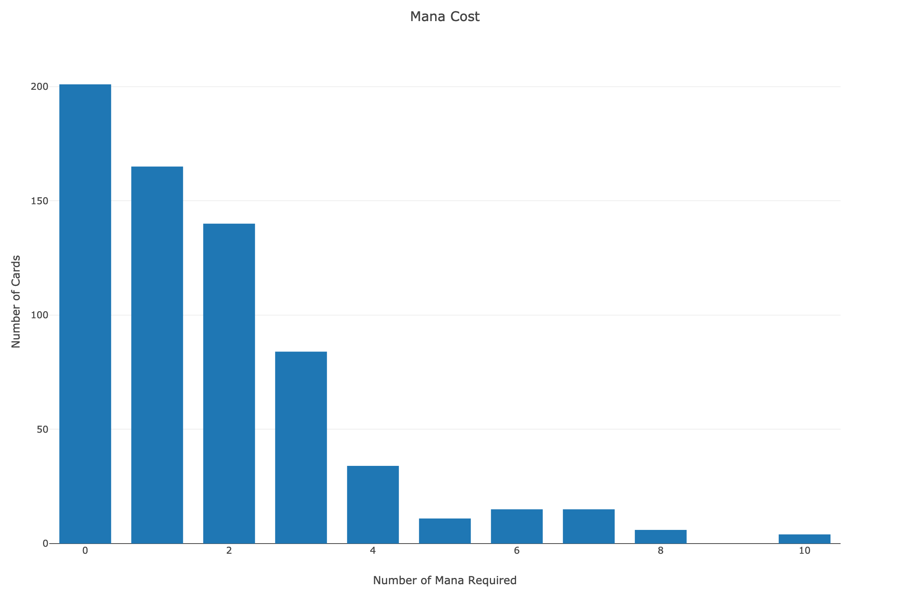
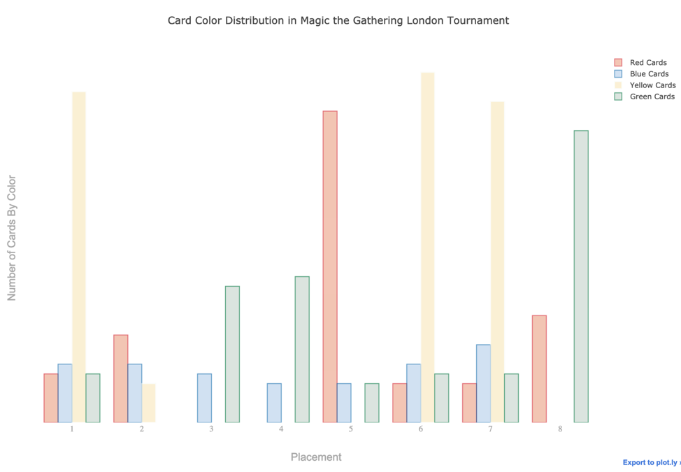
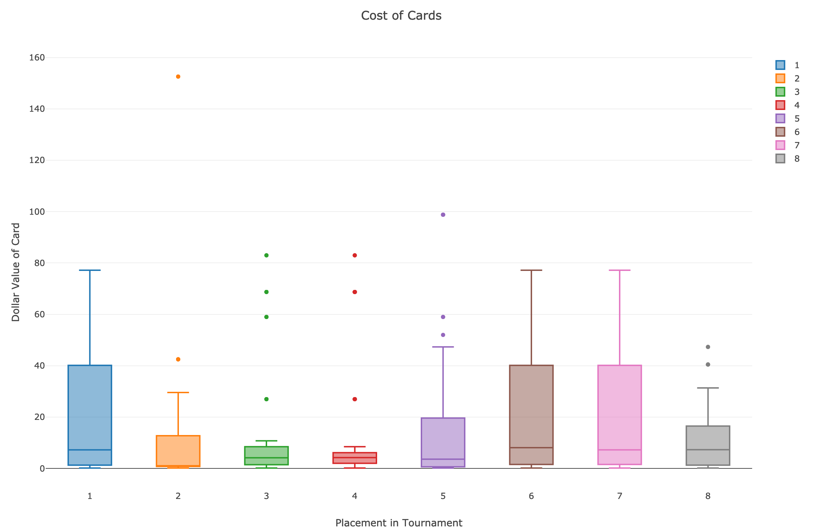

# Visualizing Magic the Gathering

## Question

When someone first starts playing the modern format of Magic the Gathering, of the question of how to choose cards for a deck comes up. Often the advice is having a lot of low mana creatures, stick to one or two colors and if you buy a card, there are cheap good ones that will help you more. All of this advice is good as it counters natural impulses in a new player that hurt them badly at first.

I am investigating whether this is something that works well for beginners but should be abandoned once you know more about the game or if it is solid advice at all levels of play. I gathered data on the cards used in a modern tournament, looked at the patterns in their cards that relate to these tips, and this is what I found.
## Analysis

### Have Low Mana creatures

It would seem that this rule is followed, but probably not as much as a new player listening to this advice would. It seems that as you learn more about the game, you should use your knowledge to choose slightly more powerful cards and a few super costly creatures. 

### Choose One or Two Colors

Again, it seems that the competitors generally listen to the rule with some exceptions. Notice any patterns in the decks have more than two colors? It seems that as people get more experienced, they tend to include some cards from ‘auxiliary’ colors. Most often these support cards tend to be from the color blue. I can say the reason for this is blue cards tend to have ‘counter spells’ which are necessary in competitive matches. 

### Don’t Buy Expensive Cards

It would seem that these competitive players to not listen to this advice at all! The cards in their decks are very expensive with the most expensive card costing 150 dollars! I talked to some domain experts about this, they made a good point that the reason some of these cards are expensive is they are used in competitive play, so don't let the prices here deter you. This may be an area for more analysis, but it would require a data source on lower levels of play and I have not seen one. If someone has seen this kind of data please send me a message with a link!

# Application
These patterns can help someone that is becoming intermediate by explaining how to deviate from the advice they have been living by so far. If you are becoming intermediate, you may want to spend a little money on your deck but also don’t hesitate to throw a couple blue cards in to make your deck more reactive. Finally, if there is a card that is three or four mana that will really help your deck, throw it in. But only have one or two ‘big cards’ which cost more than five mana.

I hope that this advice will help people who are looking for advice on how to take their Magic deck to the next level.
